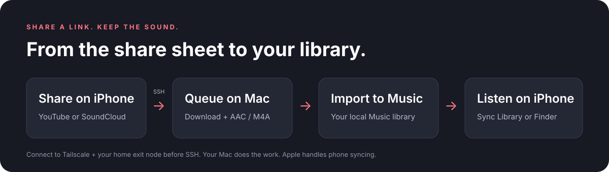
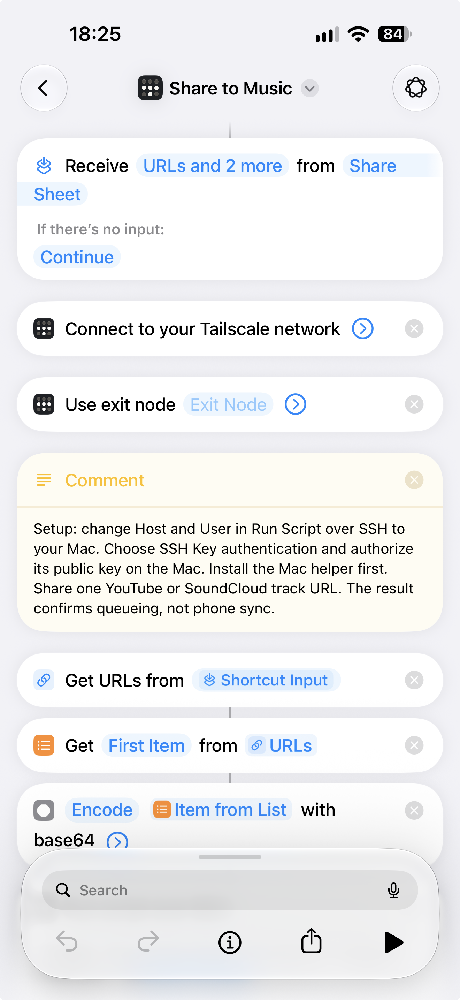
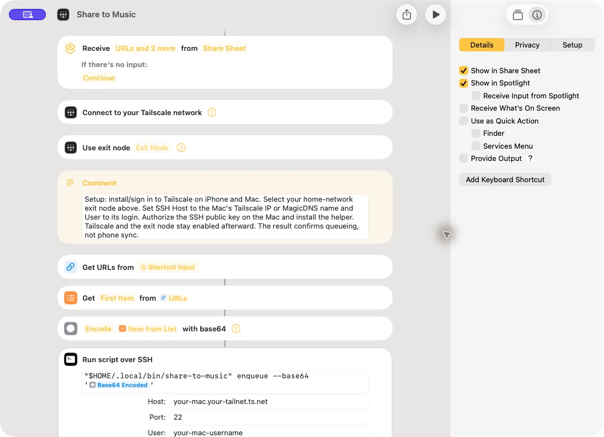
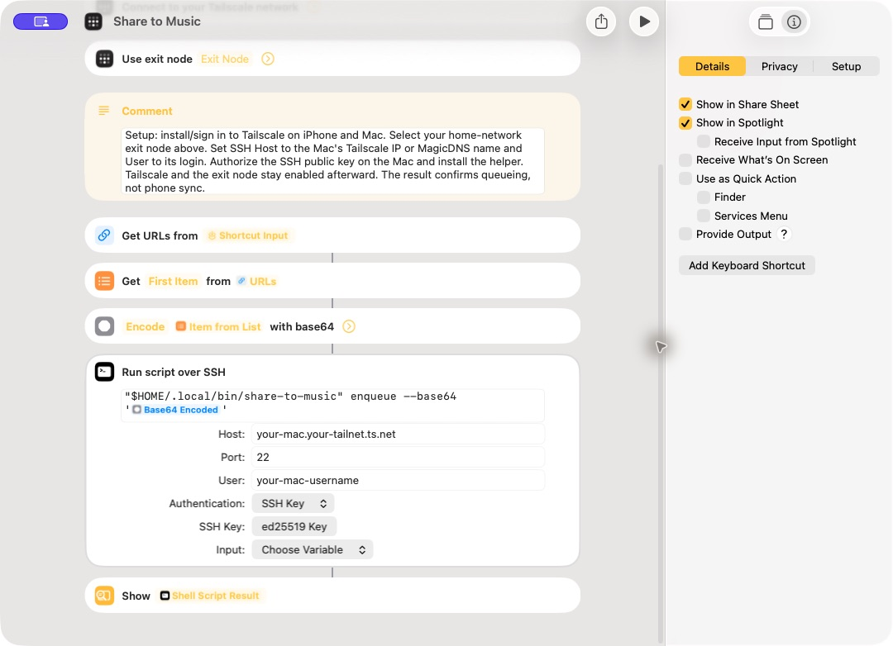

# Share to Music

**Share a YouTube or SoundCloud link on your iPhone. Let your Mac turn it into audio in Music.**



[Download the Shortcut](https://github.com/aklarby/share-to-music/raw/refs/heads/main/shortcuts/Share%20to%20Music.shortcut) · [Setup walkthrough](docs/setup.md) · [Troubleshooting](docs/troubleshooting.md)

Share to Music connects an iPhone Share Sheet Shortcut to a small Python helper on your Mac. The Shortcut connects to Tailscale, selects your home-network exit node, and sends one link over SSH. The Mac queues it, downloads its audio with `yt-dlp`, converts it to AAC in an `.m4a` file, and imports it into Music. The phone can disconnect as soon as the Mac confirms the job is queued.

**Automatic syncing to your iPhone requires Apple Music or iTunes Match, the same Apple Account, and Sync Library enabled on both devices.** Without a subscription, use Finder to sync the imported tracks. Apple handles syncing; this helper cannot guarantee when a track appears on your phone. [Apple's Sync Library guide](https://support.apple.com/118285)

## What it does

- Accepts individual YouTube videos, Shorts, YouTube Music video links, and SoundCloud track/share links.
- Connects the iPhone to Tailscale and uses your selected home-network exit node before SSH.
- Runs downloads in a per-user background queue, independent of the SSH connection.
- Writes 256 kbps AAC with title, artist/uploader, album, and an import identity tag. Source quality still limits the result.
- Optionally uses a native Mac **Clean Music Tags** Shortcut to name the song and artist with ChatGPT or Apple Intelligence, without an API key.
- Embeds matching catalog artwork or the source thumbnail; failed enrichment still permits audio import.
- Avoids repeated imports by normalizing URLs and checking a source marker in Music.
- Saves progress and logs; a failed Music import can retry using the audio already downloaded.
- Includes a signed, downloadable `.shortcut`, inspectable source, a generator, and automated tests.

Version 0.2 supports one track per share, finished uploads up to two hours, and output under 190 MB. Playlists, channels, live streams, and authenticated/DRM-protected downloads are outside this version's scope. Use it for audio you own or are permitted to download.

## Before you start

| You need | Why |
| --- | --- |
| A Mac with Music and a logged-in desktop session | The background worker imports into that user's library |
| An iPhone with Shortcuts | The Share Sheet sends the link |
| Tailscale on iPhone and a home exit node, plus a route to the Mac | Use the Mac's home-LAN address, or install Tailscale on the Mac for direct access |
| Python 3.10+, yt-dlp, ffmpeg/ffprobe, and Deno | Downloading and conversion; Deno supports YouTube extraction |
| Remote Login enabled on the Mac and the iPhone's SSH public key authorized | Allows the phone to submit a job as your Mac user |
| Sync Library or Finder syncing | Transfers the imported library entry to the phone |

The Mac must be online and awake to process jobs, with your desktop user logged in. Its screen can be off or locked; Terminal does not need to stay open. Remote Login does not keep a Mac powered on or create a desktop session. See [sleep and wake guidance](docs/ssh.md#screen-off-locked-asleep-or-logged-out). This is a macOS tool; Windows and Linux workers are not supported. Initial validation used macOS 26.5.1; other macOS/iOS versions may label settings differently.

## 1. Install the Mac helper

Install [Homebrew](https://brew.sh/) if needed, then run in Terminal:

```sh
brew install python yt-dlp ffmpeg deno
git clone https://github.com/aklarby/share-to-music.git
cd share-to-music
python3 scripts/install.py
"$HOME/.local/bin/share-to-music" doctor --music
```

Open Music and finish any first-run prompts. If macOS asks to allow Music automation, approve it for the helper's host process. The installer creates a user LaunchAgent that checks for queued jobs every 15 seconds. It copies the helper into Application Support, so moving the cloned repo later does not break it.

`doctor --music` checks Music access from the current Terminal context. The background worker may need its own Automation permission; verify your first real import before relying on unattended use. The installer does not enable SSH, change Music settings, or alter your SSH keys.

## 2. Enable Remote Login and set up the network

**Remote Login is required.** On the Mac, open **System Settings → General → Sharing**, turn on **Remote Login**, then click its **ⓘ** button. Choose **Only these users** and add the account that owns your Music library. Screen Sharing, Remote Management, and Remote Application Scripting are not needed. [Step-by-step SSH setup](docs/ssh.md#1-turn-on-remote-login)

Install/sign into [Tailscale](https://tailscale.com/download) on the iPhone and configure an approved exit node on your Mac's home network. Select it in the Shortcut. For **Host**, use either the Mac's reachable **home-LAN address** (with an approved home subnet route when away), or its **Tailscale address** if Tailscale runs directly on the Mac. A working `.local` name is suitable on home Wi-Fi; test separately on cellular. [Choose your network setup](docs/tailscale.md#choose-the-right-ssh-address)

Find your short Mac username with `whoami` in Terminal. Authorize the **iPhone's public SSH key**, then test it before turning off password login. Selecting “SSH Key” in the Shortcut does not disable password access to the Mac's SSH server. The [key-only SSH guide](docs/ssh.md#5-disable-password-login-and-require-a-public-key) includes server settings, verification, and recovery steps. No public router port forwarding is needed.

## 3. Add the iPhone Shortcut

1. Download [Share to Music.shortcut](https://github.com/aklarby/share-to-music/raw/refs/heads/main/shortcuts/Share%20to%20Music.shortcut) on your iPhone. If Safari saves it, open it from **Files → Downloads**, then tap **Add Shortcut**.
2. Select your home-network node in **Use Exit Node**. Leave **Connect to your Tailscale network** as the first action. Install/open Tailscale first if these actions are unavailable.
3. In **Run Script Over SSH**, replace `your-mac.your-tailnet.ts.net` and `your-mac-username` with your chosen Mac LAN/Tailscale address and short login name. Port is normally `22`.
4. Choose **SSH Key** authentication and add its public key to your Mac's `authorized_keys` as described in the [SSH key walkthrough](docs/ssh.md#3-authorize-the-iphones-public-key). The distributed file contains no password or private key.
5. In Shortcut Details, confirm **Show in Share Sheet** is enabled. The Shortcut accepts URLs, text, and Safari webpages and uses the first URL it finds.
6. If scripting actions are disabled, turn on **Allow Running Scripts** in Shortcuts' advanced settings on the device running the Shortcut. [Apple's scripting settings guide](https://support.apple.com/guide/shortcuts/apdfeb05586f/ios)

The action chain is **Tailscale Connect → Use Exit Node → Get URLs → First Item → Run Script Over SSH → Show Result**. The URL goes directly into the SSH action’s **Input** field as **Text**. The fixed command is `"$HOME/.local/bin/share-to-music" enqueue --stdin`; no Base64 or URL variable belongs in the script text. The exit node remains selected afterward; turn it off in Tailscale when you no longer want it.

### Setup screenshots

The iPhone screenshot shows the network actions in place. Tap the unconfigured **Exit Node** field to choose your home node before running. The Mac screenshots show the editor and SSH/Share Sheet settings with placeholder connection details.







## 4. Choose how music reaches your phone

**Cloud:** enable **Music → Settings → General → Sync Library** on the Mac. On recent iOS versions, enable **Settings → Apps → Music → Sync Library** on the iPhone. Use the same Apple Account with Apple Music or iTunes Match. A local import may need time to upload or match. Download the track in the iPhone Music app if you want offline playback. [Apple's device/library instructions](https://support.apple.com/guide/music/musa3dd5209/mac)

**Finder:** connect the iPhone to the Mac, select it in Finder, choose **Music**, choose what to sync, and click **Apply/Sync**. Finder also supports Wi-Fi syncing after initial cable setup. Review any “Erase and Sync” prompt carefully if the phone previously used a different library. The helper does not initiate Finder syncing. [Apple's Finder guide](https://support.apple.com/102471)

## 5. Share a track

In YouTube or SoundCloud, tap **Share → More → Share to Music**. You can also run it directly in Shortcuts and paste the link into the text prompt. The Shortcut displays a job ID and a queue confirmation. After processing, find the title in the Mac's Music library, then wait for your chosen sync method.

Check progress on the Mac:

```sh
"$HOME/.local/bin/share-to-music" status
"$HOME/.local/bin/share-to-music" status YOUR_JOB_ID
"$HOME/.local/bin/share-to-music" retry YOUR_JOB_ID
```

**The phone’s spinner is not download or sync progress.** The Shortcut ends after showing the queue confirmation; a visible result may need to be dismissed. If it keeps spinning and `status` says “No jobs yet,” the link has not reached this queue. Check the highlighted Tailscale/SSH action and any trust/permission prompts. [Progress and connection troubleshooting](docs/troubleshooting.md#the-phone-keeps-spinning)

`complete` means **Music on the Mac confirmed the import**. It does not mean the phone has synced. `failed` includes an error and the job log location. Retries are explicit so a broken source does not loop indefinitely.

You can also queue a quoted URL directly in Terminal:

```sh
"$HOME/.local/bin/share-to-music" enqueue 'https://soundcloud.com/ARTIST/TRACK'
```

Replace the example with a real track you have permission to download.

## Optional: clean song names with a Mac model

On a Mac with Apple Intelligence enabled, install the separate [Clean Music Tags Mac Shortcut](https://github.com/aklarby/share-to-music/raw/refs/heads/main/shortcuts/Clean%20Music%20Tags.shortcut). It uses **Use Model → ChatGPT** by default; no API key is needed. Run this while at your Mac to finish first-run model permissions:

```sh
"$HOME/.local/bin/share-to-music" setup-ai
```

Follow the [optional metadata setup guide with screenshots](docs/metadata.md) for model settings, permissions, and fallbacks. The model's title and artist are used directly, with **&** between collaborating artists and clean song names without upload/version labels. There is no confidence score. Model failures fall back to source tags; artwork lookup runs automatically even without AI. All processing happens in the Mac worker, so **your iPhone Shortcut stays unchanged**.

## Files, privacy, and maintenance

Runtime files live in `~/Library/Application Support/Share to Music/`: `audio/` holds retained M4A files, `queue.sqlite3` holds jobs, `logs/` holds diagnostics, and `staging/` holds incomplete downloads. This directory is private to your user. Do not delete the audio directory unless you have verified Music has its own copies; Music can reference imported files in place. [Apple's import behavior](https://support.apple.com/guide/music/mus3081/mac)

The command is `~/.local/bin/share-to-music`; the agent is `~/Library/LaunchAgents/com.share-to-music.worker.plist`. No project telemetry or project-hosted server is used. The SSH connection travels through your tailnet; downloads happen on the Mac, and Apple handles cloud syncing if enabled. Tailscale has its own network services. Logs can contain URLs/private-track tokens; review them before sharing.

To update:

```sh
git pull --ff-only
brew upgrade yt-dlp ffmpeg deno
python3 scripts/install.py
```

To remove the worker and command while keeping your audio and queue:

```sh
python3 scripts/install.py --uninstall
```

Delete the Shortcut separately in Shortcuts. Music library entries and downloaded files are preserved.

## Development and validation

```sh
python3 -m unittest discover -s tests -v
python3 scripts/build_shortcut.py        # reproducible JSON + unsigned plist
python3 scripts/build_shortcut.py --sign # macOS: sign distributable for anyone
python3 scripts/build_metadata_shortcut.py --sign # separate Mac AI helper
```

The tests exercise URL validation, queue durability, worker locking, failed-import recovery, installer paths with spaces/quotes, Shortcut variable wiring, and real AAC conversion when ffmpeg is installed. Music calls and network downloads are mocked in the automated suite. See [validation notes](docs/validation.md) for what has and has not been tested on real devices.

The [signed Shortcut](shortcuts/Share%20to%20Music.shortcut) is ready to distribute as a GitHub download. You can also import it, then use Shortcuts' Share action to make an iCloud link. Share the placeholder template, not your configured copy. [Apple's sharing guide](https://support.apple.com/guide/shortcuts/apdf01f8c054/ios)

MIT licensed. Not affiliated with Apple, YouTube, or SoundCloud. Built on [yt-dlp](https://github.com/yt-dlp/yt-dlp) and [FFmpeg](https://ffmpeg.org/).
